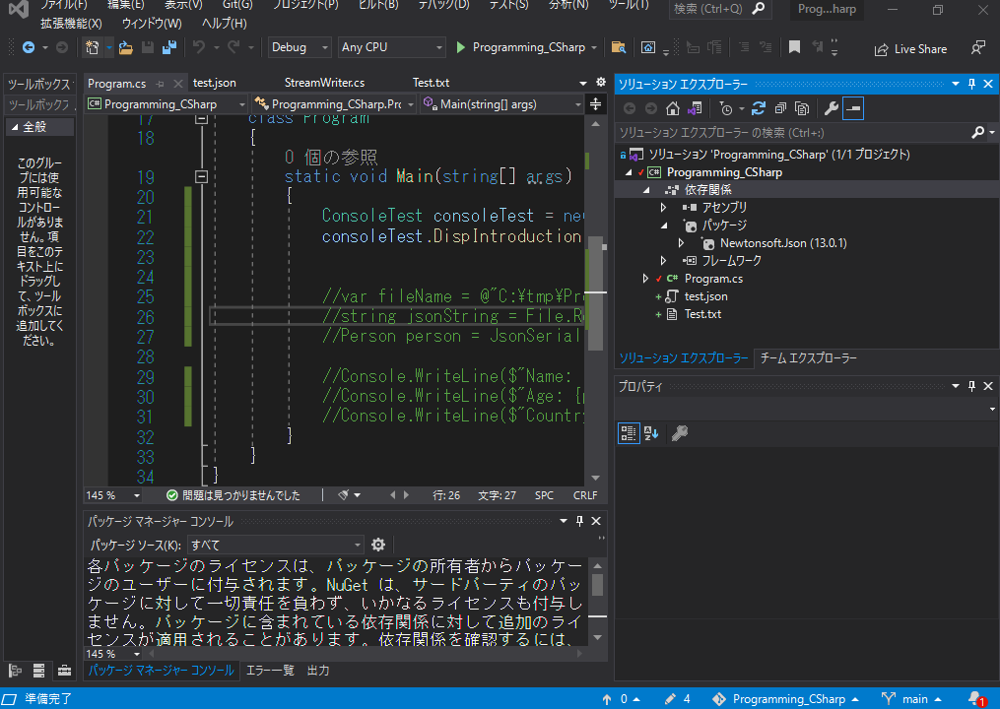

# タスク管理アプリを作る  

## 要件定義  

タスク名、概要、期限、完了フラグをトップページでリスト表示する。  
そのうち、完了タスクは背景色をグレイアウトする。  
これらのタスクは、削除、追加、編集、完了、未完了が変更可能で、タスクリストの各行にはチェックボックスを設け、複数タスクの一括削除、一括完了化、一括未完了化を可能とする。  

## 画面仕様  

<br>

### TOP画面  

TOP画面ではタスクID、タスク名、説明、期限が確認できるタスク一覧を表示する。  
また、タスクは削除、追加、編集ができ、チェックボックスを複数選択することで複数タスクの一括削除が可能である。  

  

<br>

### タスク追加画面  

タスク追加画面は、タスク名、説明、期限を入力し、「Save」ボタンをクリックした時点でタスク追加画面を終了し、タスク一覧画面に反映する。  

  

<br>

### タスク編集画面  

タスク編集画面では、タスク一覧より選択したタスクの編集が可能である。  
編集項目が完了した後、Saveボタンをクリックすることで、タスク編集画面を終了し、タスク一覧画面に反映する。  

  

<br>

## 処理詳細  

<br>

### クラス一覧  

本アプリケーションで使用するクラスは以下。  

| クラス名   |     概要      |
| --- | ----------- |
|  Top   | Top画面クラス |
| IniFileService    | Iniファイルの読み込みを行う |
| TasksDto    | JSONファイルからTaskクラス一覧を格納するためのクラス |
| Task    | タスククラス。<br>id, taskName, dscription, dueDate, isDoneを持っている |
| TaskService    | Task一覧を管理するクラス |
| AddTask    | Task編集画面および、Task追加画面クラス |

<br>

### 初期化処理

TOP画面の初期化時に、Iniファイルの格納場所を指定して```IniFileService```にてIniファイルを読み込む。  
Iniファイルにはタスクファイル(JSON)の格納場所が記述してあり、取得したIniファイルの内容から、```TaskService```にてタスクファイルを読み込む。  
```TaskService```では、タスクファイルから読み込んだタスク一覧を```TasksDto```として保持する。  

  

***各種ファイルの読み込みは以下のパッケージを用いる***  

- Iniファイルの読み込みは[INI File Parser](https://github.com/rickyah/ini-parser)を用いる。  
- JSONファイルの読み込みには、[Newtonsoft](https://www.newtonsoft.com/json)を用いる。  

また、画面のロードイベントを追加し、```TaskService```が保持しているタスク一覧より、画面に表示するタスクリストコントローラーを生成する。  

  

<br>

### タスク編集処理  

タスクの編集は、タスク一覧より任意のタスクを選択した状態でEditボタンをクリックすることで実行される。  
この時、タスク一覧にて、タスクが選択されていない場合は何もせず処理を終了する。  
タスク編集処理が実行されると、現在選択されているタスクをTaskServiceクラスより取得し、タスク編集画面へ設定した後、タスク編集画面を表示する。  
タスク編集画面では、画面のロードイベント時に設定されているタスクよりタスク名、タスク概要、タスク期限をテキストボックスに表示する。  

また、タスク編集画面ではSaveボタンがクリックされた際に、各種コントローラーに記載されている内容でTasksDtoクラスのインスタンスを生成し、TaskServiceクラスへ通知する。  
TaskServiceクラスでは、通知されたタスクインスタンスを元に自身の持つタスク一覧よりid検索を行い、該当するタスクの内容を通知されたタスクの内容で上書きする。  
TaskServiceクラスのタスク更新が完了すると、タスク編集画面は「新しいタスクを追加しました。」というメッセージボックスを表示し終了する。  

タスク編集画面が終了した後、トップ画面は、TaskServiceクラスよりタスク一覧を再取得し、タスクリストを更新する。  

  

## Program tips  

<br>

### ファイル操作  

<br>

#### テキストファイルの読み込み  

C#からファイル操作を行うには、```System.IO```ネームスペースを用いる。  
テキストファイルの読み込みは、```StreamReader```クラスを用いる。  
```StreamReader```クラスはインスタンス生成時に、読み込み対象のファイルを指定する事で、対象のファイルを開き、```ReadToEnd```関数を用いてファイル内の全ての文字列を読み込む。  
ファイルへの操作が完了したら、```Close```関数を用いてファイルの制御を終了する。  


```CSharp
StreamReader sr = new StreamReader(@"C:\Programming\SRC\Programming_CSharp\Programming_CSharp\Test.txt");
string str = sr.ReadToEnd();
sr.Close();
Console.WriteLine(str);
```  

<br>

##### 文字列のエスケープシーケンスについて  

ファイルパスを指定する際、「\」を用いてフォルダ間の接続を表すが、「\」はC#ではエスケープシーケンスとして認識される。(「\t(タブ)」や「\n(改行)」などに用意された特別な意味を持つ文字)  
そこで、パスを指定する際には文字列の先頭に「@」を付与することで、その文字列内のエスケープシーケンスを無視する事ができる。(その文字列内の「\」は、単なる文字としての「\」として認識される。)  

<br>

#### テキストファイルの書き込み  

C#からテキストファイルにテキストを書き込む際は、以下のように記述する。  

```CSharp
var writer = new StreamWriter(@"C:\Programming\SRC\Programming_CSharp\Programming_CSharp\Test.txt",false);
writer.WriteLine("この内容を書き込みます。");
writer.Close();
```  

<br>

#### Jsonファイルの操作  

<br>  

##### Jsonファイルとは  

JSONとは「JavaScript Object Notation」の略で、「JavaScriptのオブジェクトの書き方を元にしたデータ定義方法」のこと。  

JavaScriptでオブジェクトを作成する際は {} や [] などの括弧を使って記述しますが、JSONはその記法を元にしている。元々はJavaScriptで使われる想定で作成されたデータ構造なので、JavaScriptと非常に相性が良い。現在はJavaScript以外にもPythonやJava、PHPなどの幅広い言語で使われていて、JavaScriptなどのクライアント言語とPythonなどのサーバサイド言語間のデータのやり取りで使われることが多い。  

```Json
{
    "id": 1,
    "name": "tanaka",
    "result": [
        87,
        83,
        71,
        59,
        91
    ]
}
```  

#### Jsonファイルの読み込み  

C#によるJsonファイルの読み込みは、```Newtonsoft.Json```と、```Newtonsoft.Json.Converters```を用いる。  

##### パッケージとライブラリ  

***ライブラリ***とは、アプリ自体ではなくアプリが使用する汎用的な機能のみを実装し、様々なアプリに機能だけ提供できるようにしたプログラム。  

***ライブラリの作り方***  

①VisualStudioで新規プロジェクトを追加する。  

②新しいプロジェクトの作成画面で、「クラスライブラリ」を選択する。  
  

③任意の構成情報を入力する。  
  

④追加情報を入力する。(操作なし)  

⑤自動で追加されたファイルにクラス情報を記述する。  
今回は、以下のようなプログラムを作成した。  

```CSharp
using System;

namespace TestLibrary
{
    public class ConsoleTest
    {
        public void DispIntroduction(string name, int age)
        {
            Console.WriteLine($"こんにちは、私の名前は{name}です。");
            Console.WriteLine($"{age}歳です。");
        }
    }
}
```  

  

⑥ビルドを実行する(ソリューションエクスプローラーで、プロジェクトを右クリック/ビルド)  
ビルドを実行すると、プロジェクトフォルダの成果物(TestLibrary\TestLibrary\bin\Debug\netcoreapp3.1)に「プロジェクト名.dll」というファイルが生成されている事がわかる。  
これが、ライブラリファイルである。  

***ライブラリを利用する***  
ライブラリを作成したら、そのライブラリファイルを使用する。  

①別のプロジェクトを立ち上げ、ソリューションエクスプローラーにて、「依存関係」を右クリック/「プロジェクト参照の追加」を選択する。

②参照マネージャ画面にて、「参照」を選択し、先ほど生成したdllファイルを選択する。  
  

<br>

  

③先ほど作成したライブラリプログラムのネームスペースをusingに追加し、以下のようなプログラムを記述する。  

```CSharp
using TestLibrary;

namespace Programming_CSharp
{
    class Program
    {
        static void Main(string[] args)
        {
            ConsoleTest consoleTest = new ConsoleTest();
            consoleTest.DispIntroduction("Tokuda", 30);
        }
    }
}
```  

④実行してみる。  

先ほど作成したプログラムが別アプリから使えるようになっている事が確認できる。  

  

<br>

#### Nugetパッケージ  

上記のような方法でライブラリを作成したとして、例えば、ライブラリのプログラムを以下のように変更したとする。  

```CSharp
public void DispIntroduction(string name, int age, bool male)
{
    Console.WriteLine($"こんにちは、私の名前は{name}です。");
    Console.WriteLine($"{age}歳です。");
    if(male)
    {
        Console.WriteLine("男性です。");
    }
    else
    {
        Console.WriteLine("女性です。");
    }
}
```  

<br>

この時、ライブラリを使用しているプログラムでは、```consoleTest.DispIntroduction("Tokuda", 30);```という部分がエラーになる(引数が合わないため)。  
ライブラリを別の開発チームが作成していた場合、その更新内容を逐一共有する必要があるとともに、ライブラリのバージョンがどのような状態なのかをアプリ側の開発チームで把握する必要がある。  
そのような手間を省略するためにできたのが、***NuGet***と呼ばれるライブラリのバージョン管理ツールである。  
NuGetでは、ライブラリの事をパッケージと呼んでおり、世界中のライブラリ開発者が開発したライブラリが管理されている。  
NuGetがあることで、世界の誰かが開発した便利なライブラリを誰もが使用できるようになる。  

***NuGetを利用してパッケージを追加する***  

①ソリューションエクスプローラーからプロジェクトを右クリック/「NuGetパッケージの管理」を選択。  

②NuGetパッケージマネージャが立ち上がるので、任意のパッケージを選択する。  
今回は「Newtonsoft.Json」を選択する。  

  

③任意のパッケージを選択したら、画面右の「インストール」ボタンをクリックする。  

④パッケージのインストールが終わったら、NuGetパッケージマネージャを閉じて、ソリューションエクスプローラーからプロジェクトの「依存関係/パッケージ」を展開する。  
先ほどインストールしたパッケージが追加されていたら、パッケージの追加が成功している。  

  

⑤追加したパッケージを使用する。  
使い方はライブラリと同じで、使用するネームスペースを追加し、後は実装するだけ。  
※今回は使い方を知っている前提で勧めるが、本来は使用するパッケージを決める段階である程度使い方を調べておく。  

使用するネームスペースは以下。  

```CSharp
using Newtonsoft.Json;
using Newtonsoft.Json.Converters;
```  

今回は、以下のようなjsonファイルを用意した。  

```Json
{
  "tasks": [
    {
      "id":  0,
      "taskName": "宿題",
      "discription": "今週中の宿題",
      "dueDate": "25/11/2021",
      "isDone": false
    },
    {
      "id": 1,
      "taskName": "掃除",
      "discription": "今月中に部屋の掃除をする",
      "dueDate": "30/11/2021",
      "isDone": true
    }
  ]
}
```

JSonファイルに記述されている内容を格納するためのモデルクラスを用意する。  
Json内に配列として記述されている内容は、それ単体のメンバ変数として扱う必要があったため、実際のデータを配列の形で持つ```TasksDto```クラスを用意し、それに格納する。(List型については後述)  

```CSharp
namespace UISample.Models
{
    public class TasksDto
    {
        public List<Task> tasks;
    }

    public class Task
    {
        public int id;
        public string taskName;
        public string discription;
        public DateTime dueDate;
        public bool isDone;
    }
}
```

jsonファイルの読み込みは以下のように行う。  
ファイルを読み込むまでは、通常のファイル操作と同じ。  
読み込んだ文字列を```JsonConvert```クラスの```DeserializeObject```関数に渡す。  
この時、<>内に格納するクラスを指定する。  
また、```DeserializeObject```関数の引数として、```new IsoDateTimeConverter { DateTimeFormat = "dd/MM/yyyy" }```を渡しているが、これは読み込んだ文字列を解釈する際に特別な処理が必要な場合に記述する。  
今回は、```Task```クラスの```dueDate```が```DateTime```型であるのに、Jsonファイル内では、```"dueDate": "30/11/2021"```のように文字列として格納されているため、それをDateTime型に変換するために記述されている。(DateTime型とジェネリック(<>)は後述する)  

```CSharp
StreamReader r = new StreamReader(filePath);
string jsonString = r.ReadToEnd();
data = JsonConvert.DeserializeObject<Models.TasksDto>(jsonString, new IsoDateTimeConverter { DateTimeFormat = "dd/MM/yyyy" });
r.Close();
```  

これで、追加したNuGetパッケージを使用できる状態になっている。  

<br>
<br>

### コレクション型  

コレクションとは、オブジェクトの集合を表す。  
コレクションを使用するには、```System.Collections```名前空間と```System.Collections.Generic```名前空間を使用する。  

```CSharp
var 変数名 = new コレクション名<要素の型>();
```  

例：  

```CSharp
var list = new List<string>();
```  

<br>
<br>

#### List  

リストは、動的にサイズを変更できる配列。  
配列は、newした時点でサイズが決まっていたが、Listは可変の配列を生成できる。  

```CSharp
string[] strings = new string[5]();

strings[0] = "aaa";
strings[1] = "bbb";
strings[2] = "ccc";
strings[3] = "ddd";
strings[4] = "eee";
```  

この場合、stringsに格納できる文字列の数は5個で固定されるが、以下のようにすると、後からいくつでも要素を増やせる。  

```CSharp
List<string> strings = new List<string>();
strings.Add("aaa");
strings.Add("bbb");
strings.Add("ccc");
strings.Add("ddd");
strings.Add("eee");
strings.Add("fff");
```  

さらに、```List```型を使用する事で、配列にはなかった様々な機能を使用することができる。  

```CSharp
// Listへのアクセスは、配列と同じように行う。
Console.WriteLine(strings[1]);     // bbb

// 配列同様、foreach構文で要素を１つずつ取り出せる
foreach(var data in strings)
{
    Console.WriteLine(data)         // aaa
}                                   // bbb
                                    // ...

// データの数の取得も配列と同じ
Console.WriteLine(strings.Count);   // 6
```  

<br>

***テスト***  
上記で作成したJsonファイルの読み込みプログラムにて、Jsonに記述されているデータの数を10個に増やし、その中で完了していないタスクの名前を表示するプログラム。  

<br>
<br>

#### Dictionary

コレクション型には、他にもQueue型やDictionary型などが存在するが、その中でも使用頻度の高い、ディクショナリ型について紹介する。  
コレクション型の詳細は以下を参照。  
https://docs.microsoft.com/en-us/dotnet/csharp/programming-guide/concepts/collections  

ディクショナリは、一意のキーと値のペアで管理されるデータ構造である。  
ディクショナリの宣言方法(インスタンス初期化)は以下。  

```CSharp
Dictionary<[キーの型], [値の型]> data = new Dictionary<[キーの型], [値の型]>();
```  

ディクショナリの基本的な操作方法は以下。  

```CSharp
// ディクショナリの宣言
var dic = new Dictionary<string, int>();

// ディクショナリに値を追加する
dic.Add("いち", 1);
dic.Add("に", 2);
dic.Add("さん", 3);

// ディクショナリの値にアクセスする
Console.WriteLine(dic["に"]);       // 2

// ディクショナリの値を更新する
dic["さん"] = 30;
Console.WriteLine(dic["さん"]);     // 30

// ディクショナリのキー値を順番に取得する
var keys = dic.Keys;
foreach(var key in keys)
{                                   // いち
    Console.WriteLine(key);         // に
}                                   // さん

// つまり、値を順番に取得したければ
var keys = dic.Keys;
foreach(var key in keys)
{                                   // 1
    Console.WriteLine([key]);       // 2
}                                   // 3

// ディクショナリにキーが含まれているか確認する
// 以下は、任意のキーが含まれている場合は上書きし、含まれていなければ新たに追加するプログラムである
if(dic.ContainsKey("よん"))
{
    dic["よん"] = 400;
}
else
{
    dic.Add("よん", 400);
}
```

***※ディクショナリはキーの順番は保証されていないので注意***  

<br>

***テスト***  

3人分のユーザ名とパスワードを登録し、ディクショナリで保持し、そのうちのいずれかのユーザ名とパスワードを使ってログインするプログラム。  

<br>
<br>

### ジェネリック型  

ジェネリックは、汎用的な(任意の型を受け付ける)クラス、メソッドに対して、特定の処理を行えるようにする機能である。  

<br>

#### ジェネリックメソッド  

ジェネリックメソッドでは、引数の数やデータ型、戻り値の型を指定して定義できる。  

例えば、値を2つ受け付け、大きい方の値を返す関数があったとする。  

```CSharp
int Max(int x, int y)
{
    return x > y ? x : y;
}
```  

しかし、この関数の小数版が必要になったとする。上記のMax関数は、int型で受け付けてint型を返すように定義されているため、内容は同じだが型の違う関数をもう１つ作成する必要がある。  

```CSharp
int Max(int x, int y)
{
    return x > y ? x : y;
}

double Max(double x, double y)
{
    return x > y ? x : y;
}
```  

このように、処理は同じなのに、型が違うだけで同じ関数を２つ用意する必要が出てしまう。  
そこで、ジェネリックメソッドを使うことでこのような冗長性をなくすことができる。  

```CSharp
T Max<T>(T x, T y) where T : IComparable
{
    return x.CompareTo(y) > 0 ? x : y;
}
```  

ここで使用している```T```はすべて同じ型になる。  
また、```where T :```は***ジェネリック型制約***といって、型引数がどのような機能を持っているかを指定する。  
型制約がなければ、Ｔに何の型を指定されるかわからないため、もし比較演算子が使えない型を入れる事もできる。(Max<Console, string>(xxx, yyy)など)  
そこで、この関数に指定できる型の性質を指定できるようにしているのが、ジェネリック型制約である。  
例の場合は、```IComparable```を指定する事で、比較可能である型のみ指定できるような制約を付与している。  
この場合は、```IComparable```を継承している型しか受け付けなくなる。  
詳細は割愛するが、型制約の種類の詳細は以下を参照する。  
https://docs.microsoft.com/ja-jp/dotnet/csharp/language-reference/keywords/where-generic-type-constraint  

<br>

この関数を呼び出すには、以下のようにすれば良い。  

```CSharp
Max<int>(3, 5);             // 5
Max<double>(2.5, 5.1);      // 5.1
```  

また、型引数はいくつでも追加できる。  

```CSharp
T1 method<T1, T2>(T1 x, T2 y)
{
    return x;
}

method<int, string>(3, "aaa");
```

***テスト***  

- ジェネリックメソッドを使って、引数として渡された値の型を表示する。  
型は変数.GetType()で取得できる。  

<br>
<br>

#### ジェネリッククラス  

ジェネリックはクラスにも適用できる。  

```CSharp
class Test<T> where T : struct
{
    T x;
    T y;

    public Test(T x, T y)
    {
        this.x = x;
        this.y = y;
    }

    public void Method()
    {
        Console.WriteLine(x);
        Console.WriteLine(y);
    }
}

static void Main(string[] args)
{
    Test<int> t = new Test<int>(1, 2);
    t.Method();

    Console.ReadLine();
}
```  

このクラスは、指定された型のメンバ変数xとyをコンストラクタの引数として受け取り、Method関数で出力するプログラムである。  

***テスト***  

上記のクラスをdouble型を指定して実行してみる。  

<br>
<br>

### ラムダ式  

<br>

#### デリゲート  

デリゲート型は、関数を変数に格納できる仕組み。  
デリゲート型はクラスのように宣言する。  

```CSharp
delegate 戻り値の型 デリゲート型名(引数);
```  

デリゲート型を使用する時は、デリゲート型の戻り値と引数が同じ担っている関数を```new```の際に指定することで、指定した関数が格納される。  
以下のプログラムは戻り値voidで引数がint型の値1個を持つデリゲート型を定義し、Programクラス内で同じ型、同じ引数の関数をデリゲートとして使用する事で、デリゲート名に引数を渡す形で使用している。  

```CSharp
// デリゲート型の定義
delegate void someDelegate(int a);

class Program
{
    static void Main(string[] args)
    {
        // デリゲート型の変数を用意。
        // インスタンス生成時に代入する関数を指定
        someDelegate someDelegate = new someDelegate(SomeDelegateMethod);
        // デリゲート名で呼び出し
        someDelegate(100);
    }

    // デリゲートに格納する関数
    static void SomeDelegateMethod(int data)
    {
        Console.WriteLine($"SomeDelegateMethod({data})が呼ばれました。");
    }
}
```  

デリゲートには複数のメソッドを代入することができる。  
代入には```+=```演算子を使う。  
以下は```someDelegate```型に```SomeDelegateMethod```、```SomeDelegateMethod2```、```SomeDelegateMethod3```メソッドを代入することで、```someDelegate(100);```で呼び出した際に追加した３つのメソッドが全て呼び出されている。  

```CSharp
delegate void someDelegate(int a);

class Program
{
    static void Main(string[] args)
    {
        someDelegate someDelegate = new someDelegate(SomeDelegateMethod);
        someDelegate += new someDelegate(SomeDelegateMethod2);
        someDelegate += new someDelegate(SomeDelegateMethod3);
        someDelegate(100);
    }

    static void SomeDelegateMethod(int data)
    {
        Console.WriteLine($"SomeDelegateMethod({data})が呼ばれました。");
    }

    static void SomeDelegateMethod2(int data)
    {
        Console.WriteLine($"SomeDelegateMethod2({data})が呼ばれました。");
    }

    static void SomeDelegateMethod3(int data)
    {
        Console.WriteLine($"SomeDelegateMethod3({data})が呼ばれました。");
    }
}
/*
SomeDelegateMethod(100)が呼ばれました。
SomeDelegateMethod2(100)が呼ばれました。
SomeDelegateMethod3(100)が呼ばれました。
*/
```  

***テスト***  
ユーザが名前を入力すると、以下のテーブルより名前を探し、テーブルに名前がある場合は、「こんにちは、○○さん」「出席番号は〇番です」
「○○からようこそ」を表示するプログラム。  
※ただし、「こんにちは、○○さん」「出席番号は〇番です」
「○○からようこそ」はそれぞれ別の関数で表示すること。  

| 出席番号   |     名前      |　出身  |
| --- | ----------- | --- |
| 1    | 山田太郎 | 滋賀 |
| 2    | 高木次郎 | 京都 |
| 3    | 鈴木三郎 | 大阪 |
| 4    | 田中花子 | 奈良 |
| 5    | 石田森子 | 兵庫 |  

<br>

#### ラムダ式  

delegateでは、delegateの型に合った関数を定義し代入する、という方法が取られていたが、毎回delegate型を定義して関数を増やしていてはコードがどんどん大きくなってしまう。  

そこで、もっと手軽に関数を定義し呼び出せる形にしたものがラムダ式である。  

```CSharp
(引数) => { 処理 };
```

例えば、ラムダ式を使ってある数が10より大きいかどうかを判定する処理は以下のように記述する。  

```CSharp
(int n) => { return n > 10; };
```  

例えば、以下のようなdelegateが定義されている場合、それに代入するラムダ式は以下のように記述できる。  

```CSharp
delegate bool Pred(int n);

Pred p = (int n) => { return n > 10; };
```  

***テスト***  
delegateのときに書いたプログラムをラムダ式を使って書き直す。  

<br>

#### FuncとAction  

デリゲートは、デリゲート型を定義する必要があるが、必要な処理が追加されるたびにデリゲート型を宣言するのは冗長である。  
そこで、デリゲート型の宣言を不要にしたものがFunc型とAction型である。  

***Action***型は戻り値がvoid型の処理を、***Func***型は戻り値のある処理を宣言できる。  

```CSharp
Func<引数1の型, 引数2の型, 引数3の型..., 戻り値の型>
Action<引数1の型, 引数2の型, 引数3の型...>
```  

以下は、```GetRightStr```と```GetLeftStr```をそれぞれFuncを用いて変数に格納して呼び出している例である。

```CSharp
static void Main(string[] args)
{
    string str = "This is a pen.";
    int len = 4;

    Func<string, int, string> func = GetLeftStr; 
    Console.WriteLine($"左から{len}文字: {func(str, len)}");

    func = GetRightStr; 
    Console.WriteLine($"右から{len}文字: {func(str, len)}");
}

static string GetLeftStr(string str, int len)
{
    string ret = str.Substring(0, len);
    return ret;
}

static string GetRightStr(string str, int len)
{
    int startIndex = str.Length - len;

    string ret = str.Substring(startIndex, len);
    return ret;
}
```  

また、ラムダ式を用いてFuncまたはActionに渡す事も可能である。  
以下は、```Person```クラスにおいて、```Action```型のメンバ変数を保持し、```DoAction```関数にてその関数を呼び出している。  
こうすることで、```Person```クラスの```DoAction```関数を実行した時の処理内容を```Person```クラスの外で定義することができる。  

```CSharp  
public class Person
{
    public string Name { get; set; }
    public int Age { get; set; }
    public string Country { get; set; }

    public Action<string> action { get; set; }

    public void DoAction()
    {
        action("Jump");
    }
}

class Program
{
    static void Main(string[] args)
    {
        Person john = new Person();
        john.Name = "John";
        john.Age = 18;
        john.Country = "US";
        john.action = (string actionString) =>
        {
            Console.WriteLine($"Hi, I'm {john.Name}. I'm good at {actionString}.");
        };

        Person tokuda = new Person();
        tokuda.Name = "Tokuda";
        tokuda.Age = 30;
        tokuda.Country = "JP";
        tokuda.action = (string actionString) =>
        {
            Console.WriteLine($"こんにちは、 {tokuda.Name}です。 私は {actionString}が得意です。");
        };

        john.DoAction();
        tokuda.DoAction();
    }

```

***テスト***  

- これまで書いたプログラムをFuncまたはActionを使った形に変更する。  

- 上記のPersonクラスにモーニングルーチンを格納するメンバ変数を追加し、それらを順に実行するようにしたい。  
<<ヒント>>  

1. PersonクラスにAction型の変数を作成する。この時のAction型はstring型の引数を取るようにしておく。  
2. Main関数でPersonクラスのインスタンスを生成した後、モーニングルーチンを+=演算子で追加していく。
3. 最後に、生成したPersonクラスのモーニングルーチンを順に実行する関数を実行する。  

<br>
<br>

### 匿名型  

匿名型はclass定義をその場で簡易的に定義できる構文である。  

```CSharp
var person = new { Name = "Taro", Id = 0};
Console.WriteLine(person.Name);     // Taro
Console.WriteLine(person.Id);       // 0
```  

その場でしか使わないが、その場ではクラスとして使用したいようなプログラムがある場面で、ファイルを作成してクラスを記述して、、、は面倒である。そのような場面で、その場で使う共通のクラスを匿名型として記述したりする。  

***テスト***  
以下の生徒テーブルを匿名型でリストとして作成し、全生徒の出席番号、名前、出身地をそれぞれ表示するプログラムを作成する。  

| 出席番号   |     名前      |　出身  |
| --- | ----------- | --- |
| 1    | 山田太郎 | 滋賀 |
| 2    | 高木次郎 | 京都 |
| 3    | 鈴木三郎 | 大阪 |
| 4    | 田中花子 | 奈良 |
| 5    | 石田森子 | 兵庫 |  

<br>

### DateTime型について  

DateTime型は日時を扱うための型で、様々な使い方がある。  

<br>

#### 現在時刻を取得する  

DateTime型を使って現在時刻を取得するには以下のように記述する。  

```CSharp
DateTime dt = DateTime.Now;
Console.WriteLine(dt);      // 2018/05/04 15:25:39
```

<br>

#### ToStringで日時(日付)を文字列に変換する  

DateTimeの日時をフォーマットを指定して文字列に変換するには、ToStringメソッドの引数にフォーマットを指定する。年月日は「yyyy/MM/dd」のように指定する。日時は「HH:mm:ss」のように指定する。  

```CSharp
DateTime dt = DateTime.Now;

string result = dt.ToString("yyyy/MM/dd HH:mm:ss");
Console.WriteLine(result);

result = dt.ToString("yyyy年MM月dd日 HH時mm分ss秒");
Console.WriteLine(result);

// 2018/04/26 17:33:55
// 2018年04月26日 17時33分55秒
```  

<br>

#### 日時の文字列をDateTimeに変換する方法  

Parseメソッドは日時の文字列をDateTime型に変換して戻り値として返す。  

```CSharp
string strTime = "2018/05/01 12:34:56";

DateTime dTime = DateTime.Parse(strTime);
Console.WriteLine(dTime);

strTime = "2018/05/01";
dTime = DateTime.Parse(strTime);
Console.WriteLine(dTime);

strTime = "12:34:56";
dTime = DateTime.Parse(strTime);
Console.WriteLine(dTime);

// 2018/05/01 12:34:56
// 2018/05/01 0:00:00
// 2018/05/04 12:34:56
```  
